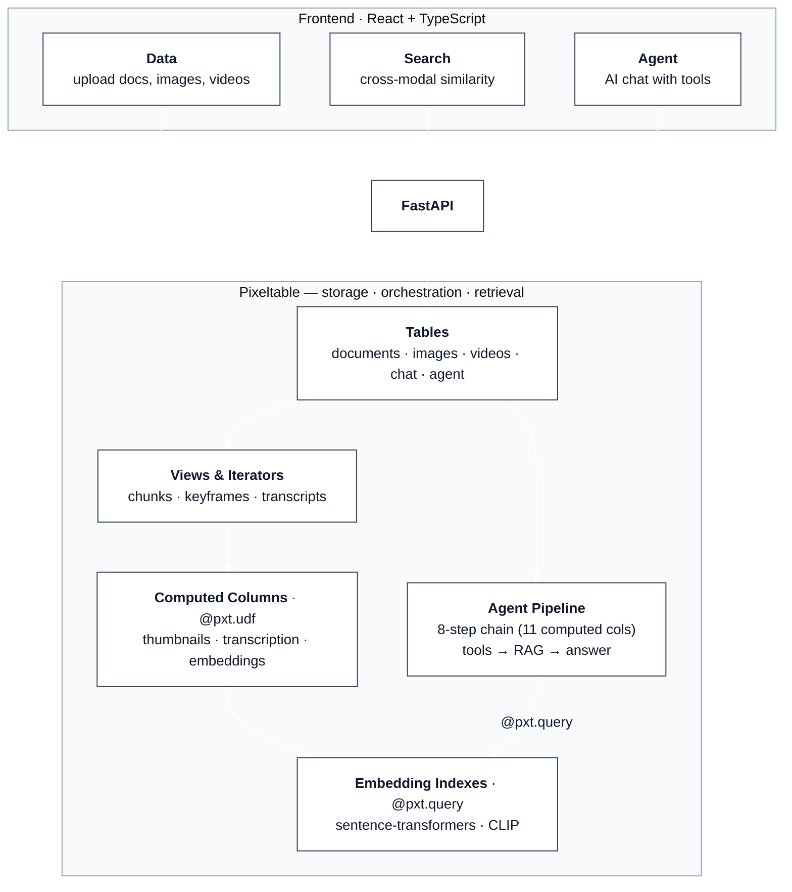
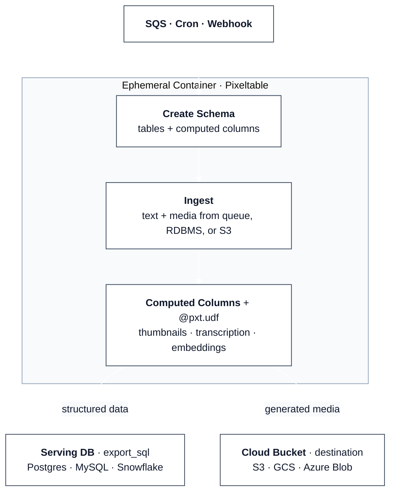

# Pixeltable Starter Kit

[Pixeltable](https://github.com/pixeltable/pixeltable) is **open-source data infrastructure for AI** — it replaces the patchwork of blob storage, metadata DBs, vector stores, media processing, orchestration, and glue code with a single declarative system. Tables, computed columns, and embedding indexes handle what typically requires stitching together S3, Postgres, Pinecone, FFmpeg, HuggingFace, Airflow, LangChain, and custom scripts to wire them all together.

This repo contains two reference architectures that map to Pixeltable's [deployment strategies](https://docs.pixeltable.com/howto/deployment/overview):

1. **Starter Kit** (this folder) — Pixeltable as **full backend**: a long-running FastAPI + React app with persistent storage. The starter kit demonstrates three core patterns through a simple three-tab UI:

    - **Data** — Upload documents, images, and videos. Pixeltable automatically chunks, extracts keyframes, transcribes audio, and generates thumbnails via computed columns and iterators.
    - **Search** — Cross-modal similarity search across all media types using embedding indexes.
    - **Agent** — Chat with a tool-calling agent (Claude) wired up entirely as Pixeltable computed columns.



2. **[Ephemeral Orchestration](orchestration/)** — Pixeltable as **ephemeral processing engine**: spin up, ingest text and media, let computed columns process everything, [`export_sql`](https://docs.pixeltable.com/howto/cookbooks/data/data-export-sql) structured results to a serving DB, and route generated media (thumbnails, audio, etc.) directly to a cloud bucket via the [`destination`](https://docs.pixeltable.com/sdk/v0.5.9/table) parameter on `add_computed_column`. No persistent infrastructure — the container shuts down when done.



These patterns extend to any use case — [ML data wrangling](https://docs.pixeltable.com/use-cases/ml-data-wrangling), [RAG applications](https://docs.pixeltable.com/use-cases/ai-applications), [agentic workflows](https://docs.pixeltable.com/use-cases/agents-mcp), and more. If you're migrating from an existing stack, see how Pixeltable maps to [DIY data pipelines](https://docs.pixeltable.com/migrate/from-diy-data-pipeline), [RDBMS + vector DBs](https://docs.pixeltable.com/migrate/from-rdbms-vectordbs), or [agent frameworks](https://docs.pixeltable.com/migrate/from-agent-frameworks).

> For a more complete example, see **[Pixelbot](https://github.com/pixeltable/pixelbot)**.

## Quick Start

**Prerequisites:** Python 3.10+, Node.js 18+, [uv](https://docs.astral.sh/uv/)

```bash
git clone https://github.com/pixeltable/pixeltable-starter-kit.git
cd pixeltable-starter-kit
cp .env.example .env   # add your ANTHROPIC_API_KEY and OPENAI_API_KEY

# Backend
cd backend
uv sync                      # installs deps + spaCy en_core_web_sm
source .venv/bin/activate
python setup_pixeltable.py   # initialize schema (idempotent; set RESET_SCHEMA=true to wipe)
python main.py               # http://localhost:8000

# Frontend (new terminal)
cd frontend
npm install && npm run dev   # http://localhost:5173
```

**Production:** `cd frontend && npm run build` then `cd ../backend && python main.py` — serves everything at `:8000`.

## Deploy

### Docker Compose (local / single server)

**Requires [Docker](https://docs.docker.com/get-docker/)** (Docker Desktop on macOS/Windows, or Docker Engine on Linux).

```bash
cp .env.example .env          # add API keys
docker compose up --build     # http://localhost:8000
```

Pixeltable data persists across restarts via named Docker volumes. Two volumes are used: `pixeltable-data` (catalog + managed blobs at `/data/pixeltable`) and `uploads` (raw files at `/app/data` that Pixeltable rows reference by path). Keep both or neither — deleting only `uploads` will dangle refs. To reset everything: `docker compose down -v`. For production, set `PIXELTABLE_INPUT_MEDIA_DEST=s3://...` so Pixeltable owns the media and the `uploads` volume becomes unnecessary.

### Helm (any existing Kubernetes cluster)

**Requires [Helm 3](https://helm.sh/docs/intro/install/)** and a running K8s cluster (EKS, GKE, AKS, k3s, etc.).

```bash
# Build and push image to your registry
docker build -t <your-registry>/pixeltable-starter:latest .
docker push <your-registry>/pixeltable-starter:latest

# Deploy
helm install pixeltable-starter ./deploy/helm/pixeltable-starter \
  --set image.repository=<your-registry>/pixeltable-starter \
  --set secrets.OPENAI_API_KEY=sk-... \
  --set secrets.ANTHROPIC_API_KEY=sk-ant-...
```

**Local testing with [minikube](https://minikube.sigs.k8s.io/docs/start/):**

```bash
minikube start --cpus=4 --memory=6144
docker build -t pixeltable-starter:latest .
minikube image load pixeltable-starter:latest
helm install pixeltable-starter ./deploy/helm/pixeltable-starter \
  --set image.pullPolicy=Never --set service.type=NodePort \
  --set secrets.OPENAI_API_KEY=$OPENAI_API_KEY \
  --set secrets.ANTHROPIC_API_KEY=$ANTHROPIC_API_KEY
kubectl port-forward svc/pixeltable-starter 9000:8000   # http://localhost:9000
```

See [`deploy/helm/README.md`](deploy/helm/README.md) for full configuration.

### Terraform (provision cluster from scratch)

**Requires [Terraform](https://developer.hashicorp.com/terraform/install)** and cloud credentials. These configs provision everything — VPC, managed K8s cluster, container registry, and all K8s resources:

```bash
# AWS EKS
cd deploy/terraform-k8s && terraform init && terraform apply

# GCP GKE
cd deploy/terraform-gke && terraform init && terraform apply

# Azure AKS
cd deploy/terraform-aks && terraform init && terraform apply
```

Each creates a managed K8s cluster with a 50Gi persistent volume for Pixeltable data. See each `deploy/terraform-*/README.md` for required variables.

### AWS CDK (ECS Fargate)

**Requires [AWS CDK](https://docs.aws.amazon.com/cdk/v2/guide/getting-started.html)** and configured AWS credentials. Serverless containers with EFS for persistent storage and an ALB for load balancing:

```bash
cd deploy/aws-cdk && pip install -r requirements.txt && cdk deploy
```

### Storage notes

All deployment options configure `PIXELTABLE_HOME=/data/pixeltable` pointing to persistent storage (Docker volumes, K8s PVCs, or EFS). For large media workloads, configure external blob storage:

```bash
PIXELTABLE_INPUT_MEDIA_DEST=s3://your-bucket/input    # or gs:// or az://
PIXELTABLE_OUTPUT_MEDIA_DEST=s3://your-bucket/output
```

See [Pixeltable Configuration](https://docs.pixeltable.com/platform/configuration.md) and each `deploy/` README for details.

## Project Structure

```
backend/
├── main.py                 FastAPI app, CORS, routers, SPA fallback
├── config.py               Model IDs, system prompts, env overrides
├── models.py               Pydantic models (row schemas + API responses)
├── functions.py            @pxt.udf definitions (web search, context assembly)
├── setup_pixeltable.py     Schema + @pxt.query (tables, views, indexes, agent pipeline)
├── pxt_serve.py            Pixeltable FastAPIRouter (v0.6+): declarative /api/pxt routes
├── pyproject.toml          Dependencies (uv sync)
└── routers/
    ├── data.py             Upload, list, delete, chunks, frames, transcription
    ├── search.py           Cross-modal similarity search
    └── agent.py            Tool-calling agent + conversations

frontend/src/
├── App.tsx                 Tab navigation (Data / Search / Agent)
├── components/             Page components + shared UI (Button, Badge)
├── lib/api.ts              Typed fetch wrapper
└── types/index.ts          Shared interfaces

orchestration/                  Ephemeral orchestration deployment pattern
├── pipeline.py                 Batch processing script (ingest → compute → export_sql)
├── udfs.py                     Pixeltable UDFs
├── Dockerfile                  Ephemeral container
└── docker-compose.yml          Local testing

deploy/
├── helm/                   Helm chart (any existing K8s cluster)
├── terraform-k8s/          Terraform + AWS EKS
├── terraform-gke/          Terraform + GCP GKE
├── terraform-aks/          Terraform + Azure AKS
└── aws-cdk/                AWS CDK + ECS Fargate
```

## Swapping AI Providers

This starter kit uses **Anthropic** (agent) and **OpenAI** (transcription). Embeddings already run locally via HuggingFace. Pixeltable integrates with [20+ AI providers](https://docs.pixeltable.com/integrations/frameworks) — including [Ollama](https://docs.pixeltable.com/howto/providers/working-with-ollama), [Gemini](https://docs.pixeltable.com/howto/providers/working-with-gemini), [Bedrock](https://docs.pixeltable.com/howto/providers/working-with-bedrock), [Groq](https://docs.pixeltable.com/howto/providers/working-with-groq), [Together](https://docs.pixeltable.com/howto/providers/working-with-together), and [more](https://docs.pixeltable.com/integrations/frameworks). To swap providers, update the computed columns in `setup_pixeltable.py` — see [LLM tool calling](https://docs.pixeltable.com/howto/cookbooks/agents/llm-tool-calling) for which providers support the agent's tool-calling pattern.

## Developing with AI Tools

Pixeltable is designed to work well with AI coding assistants. See [Building with LLMs](https://docs.pixeltable.com/overview/building-pixeltable-with-llms) for setup instructions, or jump straight to:

- **[llms.txt](https://docs.pixeltable.com/llms.txt)** — full documentation in LLM-readable format
- **[MCP Server](https://github.com/pixeltable/mcp-server-pixeltable-developer)** — interactive Pixeltable exploration (tables, queries, Python REPL)
- **[Claude Code Skill](https://github.com/pixeltable/pixeltable-skill)** — deep Pixeltable expertise for Claude
- **[AGENTS.md](AGENTS.md)** — architecture guide for AI agents working with this codebase
- **[`docs/MIGRATION_PXTFASTAPIROUTER.md`](docs/MIGRATION_PXTFASTAPIROUTER.md)** — notes on `pixeltable.serve.PxtFastAPIRouter` (PR #1268): what it replaces, where facades must stay, and a reference `/api/pxt` client

## Learn More

[Pixeltable Docs](https://docs.pixeltable.com/) · [GitHub](https://github.com/pixeltable/pixeltable) · [10-Minute Tour](https://docs.pixeltable.com/overview/ten-minute-tour) · [Cookbooks](https://docs.pixeltable.com/howto/cookbooks) · [AGENTS.md](AGENTS.md)

**Use cases:** [ML Data Wrangling](https://docs.pixeltable.com/use-cases/ml-data-wrangling) · [Backend for AI Apps](https://docs.pixeltable.com/use-cases/ai-applications) · [Agents & MCP](https://docs.pixeltable.com/use-cases/agents-mcp)

**Migrating from:** [DIY Pipelines](https://docs.pixeltable.com/migrate/from-diy-data-pipeline) · [RDBMS & Vector DBs](https://docs.pixeltable.com/migrate/from-rdbms-vectordbs) · [Agent Frameworks](https://docs.pixeltable.com/migrate/from-agent-frameworks)

## License

Apache 2.0
